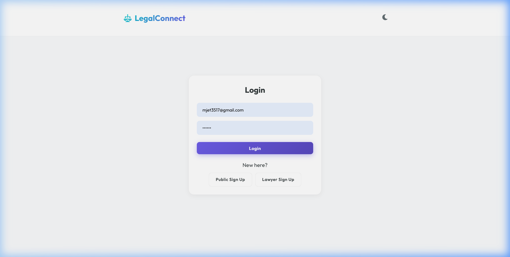
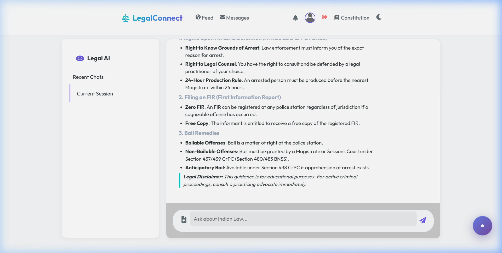
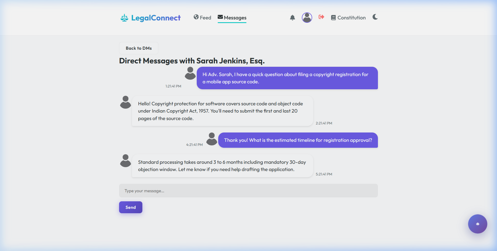
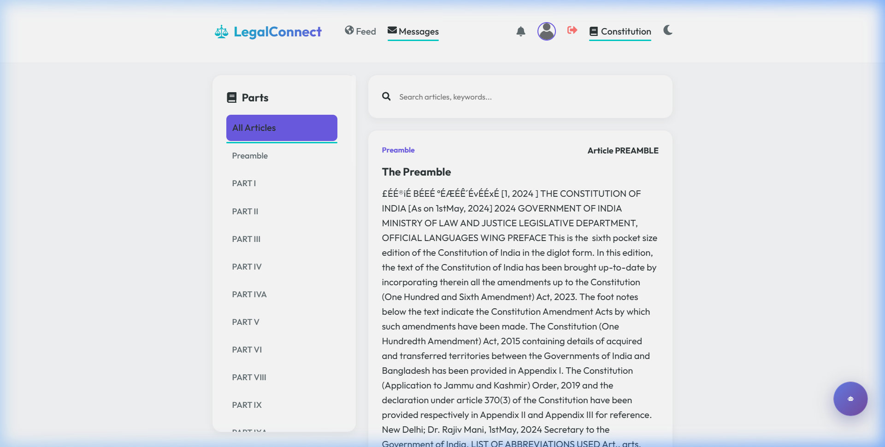

# ⚖️ LegalConnect

**LegalConnect** is a specialized legal networking, AI legal assistance, and document intelligence web platform built for legal professionals, law students, and citizens in India.

---

## 📸 Project Output Screenshots

### 1. 🏠 Community Feed & Social Hub
Share legal updates, news, and advice with interactive comments, likes, and advocate verification badges.



---

### 2. 🤖 Legal AI Assistant & Document Analysis
Dedicated Legal AI chatbot specializing in **Indian Law**, constitutional rights, criminal procedure (BNSS/IPC), and document upload parsing (`.pdf` and `.txt`).



---

### 3. 💬 Direct Messages & Attorney Consultation Threads
Secure peer-to-peer messaging system for legal inquiries, advocate consultations, and client discussions.



---

### 4. 📜 Constitution of India Digital Reference
Interactive reader for the Constitution of India, Articles, Schedules, and legal provisions.



---

## ✨ Features

- 🤖 **Legal AI Chatbot**: Powered by Gemini API with multi-model failover and offline Indian Law Assistant.
- 📄 **Document Intelligence**: Upload `.pdf` or `.txt` legal documents to extract text and analyze contract terms.
- 💬 **Messaging**: Multi-thread direct messaging with mutual follower permissions.
- 📰 **Legal Feed**: Post updates, comment, like, and report posts.
- 📜 **Constitution Viewer**: Browse complete constitutional articles and legal framework.
- 🛡️ **Lawyer Verification**: Admin verification workflow for advocates with Bar registration numbers.

---

## 🛠️ Technology Stack

- **Frontend**: React.js, Emotion UI, Material-UI, React Icons, Axios, React Markdown.
- **Backend**: Python, Flask, Flask-CORS, PyPDF2, python-docx, bcrypt, google-generativeai.
- **Database / Storage**: JSON File-based DB architecture with uploads management.

---

## 🚀 Getting Started

### 1. Prerequisites
- Node.js (v18+) & NPM
- Python 3.10+

### 2. Backend Setup
```bash
cd backend
pip install -r req.txt
python app.py
```
*Backend server runs on `http://localhost:5000`*

### 3. Frontend Setup
```bash
cd frontend
npm install
npm start
```
*Frontend application runs on `http://localhost:3000`*

---

## 📄 License
This project is open-source under the MIT License.
